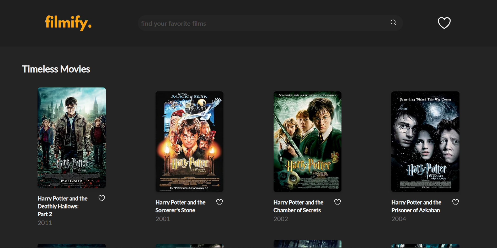

# Filmify - a Movie Information Library



## Description

Filmify is a front-end web application that allows users to explore movies through a movie title search functionality and display detailed information such as: year of make, plot summary, cast, and ratings.

## Features

- **Movie Search**: Users can search for movie by title using the Open Movie Database (OMDb) API.
- **Movie Information**: Clicking on a film card displays detailed information about the movie.
- **User Favorites**: Users can add movies to a favorites page or remove them accordingly.
- **Responsive Design**: Adapts to various screen sizes.

## Tech Stack

- **Frontend**: React, Zustand for state management, Tailwind CSS for styling
- **API**: [OMDb API](https://omdbapi.com/) for movie data
- **Design Tools**: Figma and Canva (for logo design)

## Installation

### Prerequisites

To run this project locally, ensure to install the following:

- Node.js (v14 or above)
- npm (v6 or above) or yarn

1. **Clone the repository**

```bash
git clone https://github.com/codenant/filmify.git
cd filmify
```

2. **Install dependencies**

```bash
npm install
```

3. **Register for an OMDb API key and follow these steps for set up**
   - Create a .env file at the root of the project
   - Add your OMDb API key in the following format:
   ```bash
   VITE_API_KEY=your_api_key_here
   ```
4. **Run the development server**

```bash
npm run dev
```

## Dependencies

- **React**
- **React Router**
- **Tailwind CSS**
- **React Spinners** for preloading
- **Material UI** icons
